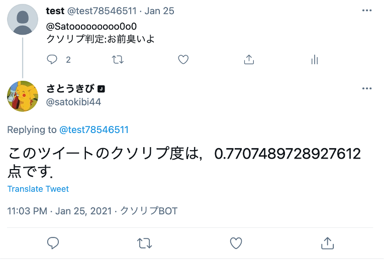
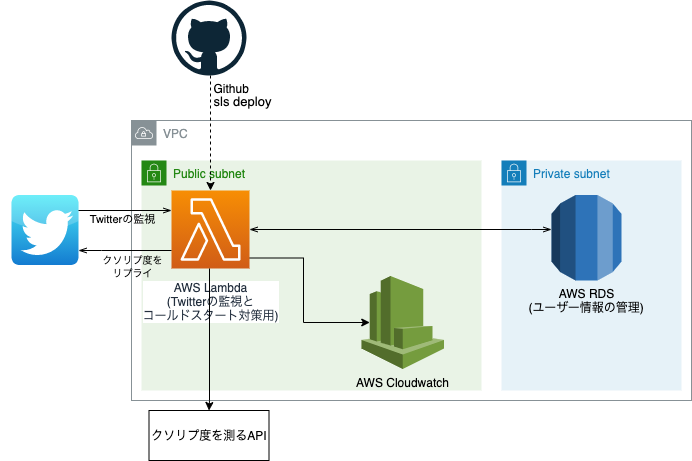

# クソリプをなくそうプロジェクト
## 概要
[クソリプAPI](https://github.com/satokibi44/Kusorep_API)で数値化したリプライのクソリプ度をユーザーに提示するBot

## ユーザー登録方法
Twitterで[@satokibi44](https://twitter.com/satokibi44)宛に「Hey!クソリプbot，クソリプに対して警告して」とリプライを送信することでユーザー登録，「Hey!クソリプbot，クソリプに対して警告しないで」とリプライを送信することでユーザー登録解除

## 作った理由
誹謗中傷などのクソリプが原因で自殺する人や心を病んでしまう人が社会問題となっている中で，そのような人たちを救いたいと思ったから．

## 工夫した点
クソリプを防ぐ様々なアプリが開発されれば，もっと社会はよくなると思ったので，クソリプ計算をAPI化した．

## 使用技術
MySQL,AWS(lambda, RDS, Cloudwatch)Docker,github actions, serverless framework
## インフラ構造
クソリプ度を測るAPIは[ここ](https://github.com/satokibi44/Kusorep_API)を参照
